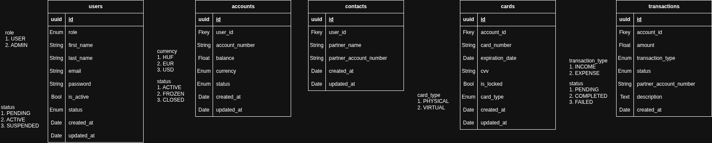

# Fake-Netbank – Projekt Dokumentáció

## Projekt áttekintése

A **Fake-Netbank** egy szimulált internetes banki alkalmazás, amely egy valódi netbanki rendszer alapvető funkcióit valósítja meg. A projekt célja kettős: egyrészt egy működőképes, szerepkör-alapú banki platform elkészítése, másrészt a Spring Boot keretrendszer elsajátítása.

---

## Technológia stack

### Backend – Spring Boot (Java)

A backend fejlesztéséhez **Java** nyelvet és **Spring Boot 4.0** keretrendszert választottam.

**Indoklás:**

A mindennapos munkám során főként **Laravel** (PHP) alapú REST API-kat fejlesztek, azonban egy netbanki rendszerhez nem PHP az elsődleges technológiai választás. Egy pénzügyi alkalmazásnál kiemelt szempont az erős típusosság, a fordítási idejű hibakezelés és az enterprise szintű eszköztár – ezek mind olyan területek, ahol a Java és a Spring Boot lényegesen jobb alapot nyújt, mint egy interpretált szkriptnyelv. A projekt egyben lehetőséget adott arra is, hogy mélyebben megismerkedjek egy ilyen környezettel.

A **Java + Spring Boot** kombináció mellett a következő szempontok szóltak:

- **Erős típusosság és fordítási idejű hibák:** Java esetén a hibák nagy részét már a fordító elkapja, szemben a PHP-val, ahol ezek futási időben derülnek ki.
- **Spring Security és JWT:** A Spring Security kiérett, részletesen konfigurálható biztonsági réteget biztosít; JWT-alapú hitelesítéssel könnyen megvalósítható az állapotmentes (stateless) autentikáció.
- **Spring Data JPA + Flyway:** Az ORM réteg és az adatbázis-migráció kezelése együtt gördülékeny, jól bevált mintákra épít.
- **Lombok:** Csökkenti a Java boilerplate kódot (getter, setter, konstruktorok automatikus generálása).
- **Datafaker:** Fejlesztési és tesztelési célokra reális seed adatok generálása.

A backend adatbázisként **PostgreSQL**-t használ.

**Fontosabb backend függőségek összefoglalva:**

| Komponens | Technológia |
|---|---|
| Keretrendszer | Spring Boot 4.0 |
| Biztonság | Spring Security + JJWT 0.12.5 |
| Adatelérési réteg | Spring Data JPA + Hibernate |
| Adatbázis | PostgreSQL |
| Migráció | Flyway |
| Boilerplate csökkentés | Lombok |
| Seed adatok | Datafaker 2.1.0 |

---

### Frontend – Refine + MUI (React, TypeScript)

A frontend fejlesztéséhez a **Refine** keretrendszert választottam, amely React és TypeScript alapokra épül, és többek közt MUI (Material UI) komponenskönyvtárral is integrálva van. (A projekhez ezt használom)

**Indoklás:**

Ez egy banki adminisztrációs és ügyféli felület, ahol a **funkcionalitás fontosabb az esztétikánál**. Nem volt cél egy látványos, animációkkal teli design – a hangsúly a backend logikán és az API-n van. A Refine pontosan erre a célra készült: CRUD-műveletek, táblázatos adatmegjelenítés, szűrés és autentikáció gyorsan és egyszerűen konfigurálható, anélkül hogy egyedi UI-komponenseket kellene nulláról felépíteni.

A Refine további előnyei:
- Beépített adatszolgáltató (`@refinedev/rest`) a REST API-val való kommunikációhoz.
- Szerepkör-alapú hozzáférés-vezérlés könnyen megvalósítható.
- React Hook Form integráció űrlapkezeléshez.
- MUI DataGrid az adattáblákhoz.

**Fontosabb frontend függőségek összefoglalva:**

| Komponens | Technológia |
|---|---|
| Keretrendszer | Refine 5.0 |
| UI komponensek | MUI (Material UI) 6.x |
| Adatbekötés | @refinedev/rest |
| Állapotkezelés / Routing | React Router 7 |
| Űrlapok | React Hook Form 7 |
| Build eszköz | Vite 6 |
| Típusosság | TypeScript 5 |

---

## Funkcionális követelmények

### Szerepkörök

A rendszer két szerepkört különböztet meg: **Felhasználó** és **Adminisztrátor**.

---

### Felhasználói funkciók

#### Autentikáció
- Bejelentkezés e-mail cím és jelszó párossal (`POST /api/auth/login`).
- A sikeres bejelentkezés JWT tokent ad vissza, amelyet a kérések `Authorization: Bearer` fejlécében kell elküldeni.

#### Számlakezelés
- Saját bankszámlák listázása (`GET /api/accounts`).
- Egy adott számla részleteinek megtekintése, beleértve az egyenleget és a státuszt (`GET /api/accounts/{id}`).

#### Kártyakezelés
- Saját bankkártyák listázása (`GET /api/cards`).
- Egy adott kártya adatainak megtekintése (`GET /api/cards/{id}`).
- Kártya zárolása / zárolás feloldása (`PATCH /api/cards/{id}/status`).

#### Tranzakciókezelés
- Adott számla tranzakcióinak listázása (`GET /api/transactions?accountId={id}`).
- Utalás indítása egy másik bankszámlaszámra, összeg és közlemény megadásával (`POST /api/transactions/send`).

#### Kapcsolatok (Kedvezményezettek) kezelése
- Mentett kedvezményezettek listázása (`GET /api/contacts`).
- Egy kedvezményezett részleteinek megtekintése (`GET /api/contacts/{id}`).
- Új kedvezményezett hozzáadása névvel és számlaszámmal (`POST /api/contacts`).
- Kedvezményezett törlése (`DELETE /api/contacts/{id}`).

#### Profilkezelés
- Saját felhasználói adatok megtekintése (`GET /api/users/me`).
- Saját kereszt- és vezetéknév módosítása (`PATCH /api/users/me`).

---

### Adminisztrátori funkciók

Az adminisztrátorok a fenti felhasználói funkciókon túl hozzáférnek az alábbi felügyeleti végpontokhoz.

#### Felhasználók kezelése
- Az összes regisztrált felhasználó listázása (`GET /api/admin/users`).
- Felhasználó státuszának módosítása – aktív, felfüggesztett (`PATCH /api/admin/users/{id}/status`).
- Felhasználó törlése (`DELETE /api/admin/users/{id}`).

#### Számlák felügyelete
- Az összes bankszámla listázása (`GET /api/admin/accounts`).
- Számlastátusz módosítása – aktív, korlátozott, felfüggesztett (`PATCH /api/admin/accounts/{id}/status`).
- Bankszámla törlése (`DELETE /api/admin/accounts/{id}`).

#### Kártyák felügyelete
- Az összes kártya listázása (`GET /api/admin/cards`).
- Új bankkártya létrehozása egy adott számlához, típus megadásával (pl. `VIRTUAL`) (`POST /api/admin/cards`).
- Kártya státuszának módosítása (`PATCH /api/admin/cards/{id}/status`).
- Kártya törlése (`DELETE /api/admin/cards/{id}`).

#### Tranzakciók felügyelete
- Az összes tranzakció listázása és ellenőrzése (`GET /api/admin/transactions`).

---

## Nem-funkcionális követelmények

### Biztonság
- Az API végpontok – a bejelentkezés kivételével – JWT token alapú hitelesítést követelnek meg.
- Az adminisztrátori végpontok (`/api/admin/**`) csak az `ADMIN` szerepkörrel rendelkező felhasználók számára elérhetők; jogosulatlan hozzáférés esetén `403 Forbidden` választ ad a rendszer.
- A jelszavak BCrypt algoritmussal kerülnek tárolásra.

### Megbízhatóság és adatkonzisztencia
- Az adatbázis-séma verziókövetve van Flyway migrációk segítségével, ezzel biztosítva a reprodukálható és visszakövethetű adatbázis-állapotot.
- Utalás indításakor a rendszer ellenőrzi a fedezet meglétét és a célszámla érvényességét, sikertelen tranzakció esetén értelmes hibaüzenettel tér vissza.

### Karbantarthatóság
- A backend rétegelt architektúrát követ (Controller → Service → Repository), amely egyértelműen szétválasztja a felelősségi köröket.
- A frontend Refine erőforrás-alapú modelljével az egyes entitások (felhasználók, számlák, kártyák, tranzakciók) kezelése egységes mintát követ.

### Fejlesztői élmény
- Datafaker segítségével az adatbázis seed adatokkal tölthető fel, így a fejlesztés és tesztelés valósághű adatok mellett végezhető.
- Indítási szkript (`start-dev-envs.sh`) biztosítja a környezet gyors felállítását.

---

## Adatbázis terv

Az adatbázis felépítése az alábbi öt táblára épül: `users`, `accounts`, `contacts`, `cards`, `transactions`. Az entitások közötti kapcsolatokat és az egyes mezők típusait az alábbi ábra szemlélteti:

A technikai felépítésről, a fejlesztői környezet beállításáról és az indítási lépésekről további részletek a projekt gyökérkönyvtárában található `README.md`-ben olvashatók.
